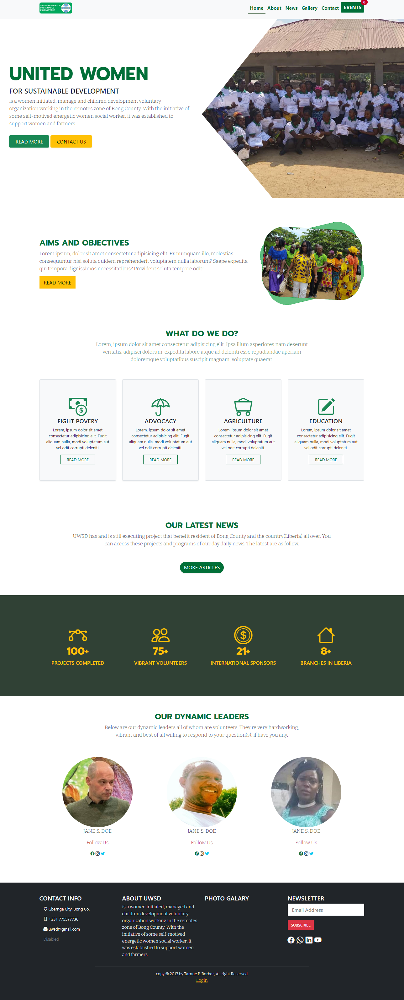

## Full NGO WEBSITE
### Front-Back End
## Technologies USED
1. Php
2. MySQL
3. HTML
4. CSS
5. Javascript
## How To USE
1. Clone this repo to the root of your server
2. Create a sql db name lovingliberia
3. Import the sql file provided in the cloned repo
Congradulation!, There you have it 
## Admin Login Info
Email: user@gmail.com
Password: 123456

##HOME PAGE PREVIEW

